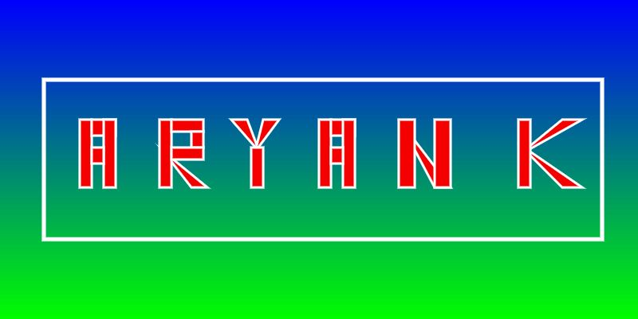

# ✨ My Nameplate using Java

One of my very first Java programs from 9th grade, a creative **letter art visualization** built in **Processing**, where each letter of the name “ARYANK” is drawn using shapes like rectangles and triangles, set on a colorful gradient background.

## 📷 Preview

  

## 🎨 Features

- Hand-crafted geometric design for each letter (A, R, Y, A, N, K)
- Smooth vertical gradient background (cyan to blue)
- White stroke outlines for artistic contrast
- Modular code for easy customization of names or colors

## 🛠️ Technologies

- [Processing (Java)](https://processing.org/): Visual arts and graphics programming

## 📦 How to Run

1. **Install Processing**: [Download here](https://processing.org/download/)
2. **Open the Sketch**:
   - Save the `.pde` file.
   - Launch it in Processing and click **Run**
3. Watch the name **ARYANK** appear with vivid style!

## 💡 Customization Ideas

- Change background gradient colors
- Add animation to letters or mouse interaction
- Replace "ARYANK" with your own name
- Export the art as an image (`saveFrame()`)
